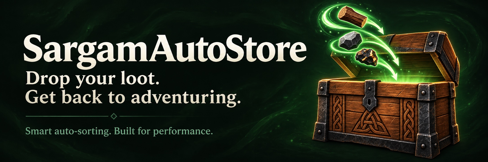

# SargamAutoStore

**Smart auto-sorting. Built for performance.**

Automatic chest storage for Valheim: existing contents first, matching signs next, then chests you designate for new item types. Receiving chests glow and transfers appear in the pickup notification area.

[Install and read the full guide on Thunderstore](https://thunderstore.io/c/valheim/p/Anatta_Labs/SargamAutoStore/).

This repository hosts public presentation assets and issue reports. The implementation is maintained separately.

## Support

[Report a problem](https://github.com/kimlage/SargamAutoStore-media/issues/new/choose) with the mod version, Valheim version, platform and steps to reproduce it. Describe the expected chest and actual result. Remove passwords, session tokens, player identifiers and private server addresses from anything you share.

## Current scope

Version 1.0. Local gameplay scenarios have been tested on macOS; multiplayer and Windows/Linux runtime validation remain pending. See the Thunderstore page for the precise tested scope and installation requirements. Do not run competing automatic-storage collectors together.

## Media

[Watch the 1.0 ground and inventory demos](releases/1.0.0/README.md), inspect the [separate performance measurements](releases/1.0.0/BENCHMARK.md), or read the [capture setup](releases/1.0.0/PROVENANCE.md). Local staged demonstrations do not establish multiplayer compatibility. The logo is original AI-generated artwork. Valheim game imagery belongs to its respective rights holders.

## Recommended companion

**Store with SargamAutoStore. Craft with [NewtCraftHub](https://thunderstore.io/c/valheim/p/Anatta_Labs/NewtCraftHub/).** Newt’s optional mod adds crafting/building from nearby storage, station refilling and chest search. It is not a required dependency.
