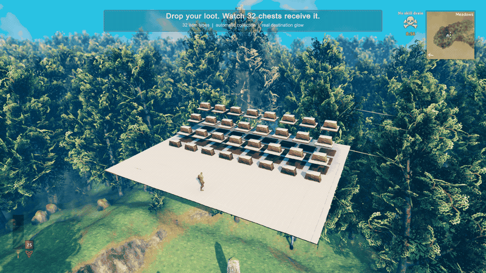
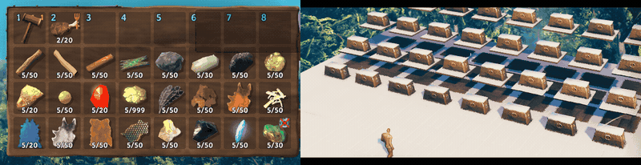

# SargamAutoStore 1.0 — watch your storage work

## Drop it. Sorted.

96 units across 32 item types automatically reach their seeded destination chests. Receiving chests light up as real transfers complete.

[Watch the ground video](ground.mp4)

## Clear your inventory. Keep your essentials.

120 units across 24 types leave the inventory through the production inventory-deposit action. The hammer and cooked meat stay in the protected hotbar. Left: inventory. Right: receiving chests. Both panels are cropped from the same frames.

[Watch the inventory video](inventory.mp4)

## Measured, not guessed

Three workloads of 1,024 ground units across 32 chests completed in **0.367–0.599 seconds** on an M3 Max, with independent saved-inventory checks. The production plugin's Update averaged **1.711–1.907 ms per sampled frame** during collection; idle averaged **0.034 ms**. The maximum observed Update was **5.714 ms**. These timings exclude drop creation and settling.

[Read all measurements, settings and limits](BENCHMARK.md) · [Capture provenance](PROVENANCE.md)

This is local singleplayer evidence, not a universal performance or multiplayer guarantee. Videos were captured separately from timed measurements.

## Store here. Craft with Newt.

Try [NewtCraftHub by Newt / Anatta_Labs](https://thunderstore.io/c/valheim/p/Anatta_Labs/NewtCraftHub/) for crafting and building from nearby storage, station refilling and `/find` chest search. Optional recommendation; not a required dependency or a combined benchmark.

[Install SargamAutoStore](https://thunderstore.io/c/valheim/p/Anatta_Labs/SargamAutoStore/)
